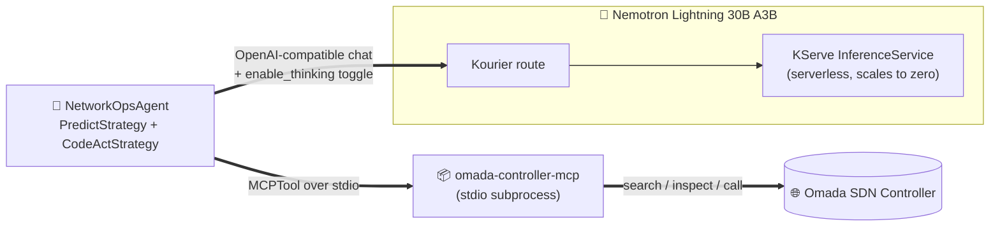

# nooa-omada-agent

[](https://github.com/samhaque/nooa-omada-agent/actions/workflows/ci.yml)


[](LICENSE)

A [NOOA](https://github.com/NVIDIA-NeMo/labs-OO-Agents) agent that manages a
TP-Link Omada SDN network: it talks to
[omada-controller-mcp](https://github.com/samhaque/omada-controller-mcp) over
MCP for the actual controller calls (sites, devices, the full Omada API
surface), and to a self-hosted **Nemotron Lightning 30B A3B** NIM for the
model. The NIM is reachable at an on-prem URL with no auth, deployed as an
OpenShift **KServe** `InferenceService` (serverless) and fronted by
**Kourier** (Knative's networking layer).

Background: NOOA is NVIDIA's "agent is a Python object" framework, see
[arXiv:2607.20709](https://arxiv.org/abs/2607.20709). Its `CodeActStrategy`
loop drives the model with a tool-calling contract (`execute_python` /
`return_result`); NOOA's chat-completion client already has a fallback parser
for `<tool_call>` XML output (`unifiedllm.py: _extract_xml_tool_calls`), which
is the tool-call format Qwen-coder-style models emit, relevant since the
served model uses that chat template. No extra glue code needed for that part.

## Architecture



`NetworkOpsAgent` exposes one `MCPTool` (`omada`, launched as a stdio
subprocess from `.mcp.json`) plus two strategy methods: `triage` for a
single-shot typed classification and `recommend_action` for a multi-step
tool-using investigation.

## Quickstart

Needs a checkout of
[omada-controller-mcp](https://github.com/samhaque/omada-controller-mcp) as a
sibling directory (`../omada-controller-mcp`), or point `OMADA_MCP_DIR` at
wherever yours lives. That repo has its own setup for talking to a real
controller; without one reachable it falls back to a bundled API spec
snapshot, enough to exercise the agent's tool-calling loop without a live
controller.

```bash
uv sync
cp .env.example .env
# edit .env: set NEMOTRON_BASE_URL to your cluster's Kourier route
uv run python -m omada_agent
```

`NEMOTRON_BASE_URL` is required, there's no public fallback for a
firewalled, on-prem endpoint. Confirm connectivity and the exact served model
name before running, NIM's `/models` response is the source of truth:

```bash
curl -s "$NEMOTRON_BASE_URL/models" | python3 -m json.tool
```

Set `NEMOTRON_MODEL_NAME` in `.env` to the `id` field from that response if it
doesn't match the default.

No cluster handy? See [`docs/LOCAL_DEV.md`](docs/LOCAL_DEV.md) for running
the same model locally in LM Studio instead, quant used, fast download, and
a known `enable_thinking` gotcha.

## Layout

| Path | What's there |
|---|---|
| `src/omada_agent/llm.py` | Builds the `UnifiedLLM` client from `NEMOTRON_*` env vars |
| `src/omada_agent/agent.py` | `NetworkOpsAgent`: `MCPTool` wired to omada-controller-mcp, `Predict` + `CodeAct` methods |
| `src/omada_agent/__main__.py` | Runnable demo (`uv run python -m omada_agent`) |
| `.mcp.json` | Tells NOOA's `MCPManager` how to launch the omada MCP server |
| `docs/DEPLOYMENT.md` | On-prem deployment notes: no-auth NIM, thinking toggle, cold starts, Omada trust model |
| `docs/LOCAL_DEV.md` | Run the same model locally in LM Studio instead of the cluster NIM |

## Tests

```bash
uv run pytest
```

Assert-based, no network calls, validates env parsing (routing prefix,
thinking toggle, api_key passthrough) before you have cluster or controller
access, or in CI.

## Contributing

See [`CONTRIBUTING.md`](CONTRIBUTING.md).
